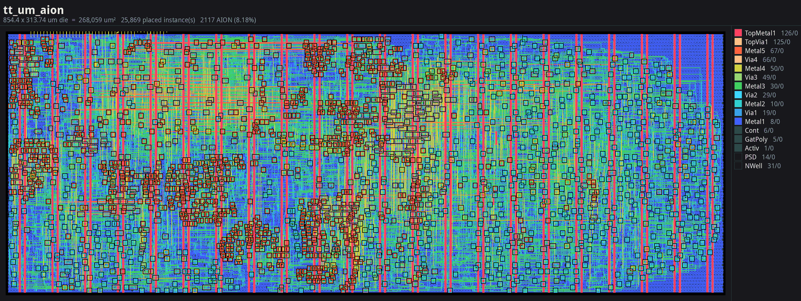
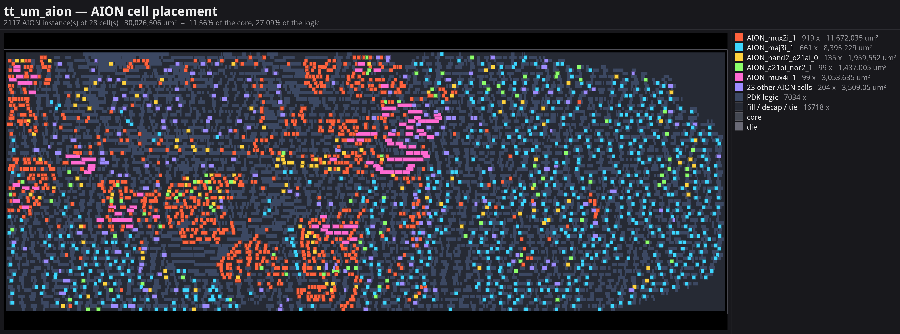
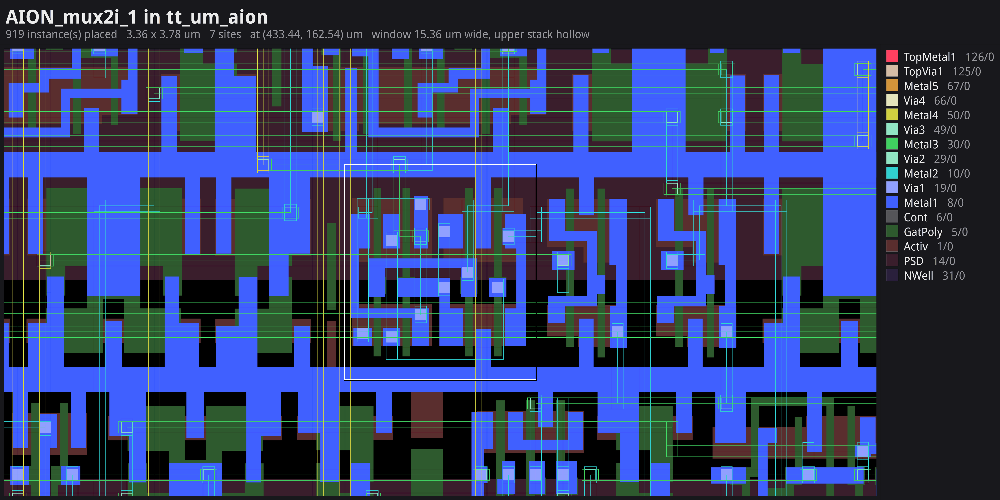

<!---

This file is used to generate your project datasheet. Please fill in the information below and delete any unused
sections.

You can also include images in this folder and reference them in the markdown. Each image must be less than
512 kb in size, and the combined size of all images must be less than 1 MB.
-->

<!--
Images: rendered from ../aion_chip/flow/7_pnr/gds/tt_um_aion.gds with ../aion_chip/scripts/render_chip.py
(die at 2800 px, placement map and close-up at 4800 px), saved as palette PNGs to stay under the limits.
-->

## How it works

AION (*AI-Optimized Netlist-to-Layout*) is a posit arithmetic unit on IHP SG13G2. It adds,
multiplies, compares and computes bitwise AND/OR/XOR on **Posit<32,2>** or **Posit<16,2>**
numbers; the precision is chosen per command. Operands and results go through a small
byte-wide register interface.

AION is a **proof of concept**: it tests whether AI can improve a circuit's performance by
creating standard cells specific to the design, instead of using only the cells the PDK provides.
**Every custom standard-cell layout on this chip was drawn by an AI agent and verified with
open-source tools**. Besides the PDK's standard cells, the netlist uses two kinds of custom cell:

- **Mined cells**: pairs of PDK cells that occur often in the synthesized design, merged into
  single new standard cells.
- **Custom logic cells**: transmission-gate inverting 2:1 and 4:1 multiplexers and an inverting
  majority gate, which synthesis picks wherever they are smaller.

For each cell, an LLM agent wrote the program that draws the layout. Open-source tools alone
decided whether it was accepted: DRC with Magic and KLayout, LVS with Netgen, parasitic extraction
with Magic, timing characterization with ngspice, and a routability check with OpenROAD. The tile
was then hardened with the open-source LibreLane flow (Yosys, OpenROAD, Magic, KLayout, Netgen).
As a reference, the same design was also hardened with PDK cells only.

### Results against the PDK-only version

Both versions use the same RTL, die, constraints (40 ns clock) and flow settings; only the cells
differ.

| Metric | PDK cells only | With AION cells | Change |
| --- | ---: | ---: | ---: |
| Standard-cell area | 121,741 µm² | 111,546 µm² | −8.4% |
| Core utilization | 46.9% | 42.9% | −3.9 pts |
| Total power (typical corner, estimated) | 129.1 mW | 99.3 mW | −23.1% |
| Routed wirelength | 406,637 µm | 359,885 µm | −11.5% |
| Setup worst slack (slow corner) | +1.87 ns | +6.90 ns | +5.03 ns |
| Hold worst slack (fast corner) | +0.150 ns | +0.138 ns | −0.011 ns |

Both versions are clean in DRC and LVS and have no setup or hold violations in any of the three
corners. The tile fixes the die size, so the saved area shows up as lower utilization rather than a
smaller chip. The gains come from both kinds of custom cell together.

*The routed 4x2 tile, coloured by metal layer; every AION cell instance is ringed.*

*Placement map: the most-used AION cells in their own colours, the rest grouped; PDK logic and
fill in grey.*

*An AI-drawn transmission-gate mux (`AION_mux2i_1`), abutted to its PDK neighbours.*

### Pins

| Pin | Use |
| --- | --- |
| `ui_in[3:0]` | register address |
| `ui_in[7]` | `1` = write, `0` = read |
| `uio_in[7:0]` | write data (all bidirectional pins are inputs) |
| `uo_out[7:0]` | read data |

### Registers

| Address | Register |
| --- | --- |
| `0x0`–`0x3` | operand A, low byte first |
| `0x4`–`0x7` | operand B, low byte first |
| `0x8` | control: `[3:0]` opcode, `[4]` precision (`0` = 32-bit, `1` = 16-bit), `[7]` start |
| `0x9`–`0xC` | result, low byte first |
| `0xD` | status: bit 0 = done |

Opcodes: `0` add, `1` multiply, `2` equal, `3` less than, `4` AND, `5` OR, `6` XOR. Equal and
less than return a flag in bit 0 of the result. For 16-bit commands, only the low two bytes of
each operand and of the result are used.

## How to test

1. Hold `rst_n` low for a few clock cycles, then release it. The design is timed for a 40 ns
   clock period (25 MHz); any slower clock works.
2. **Write** a register: set `ui_in = 0x80 | address` and `uio_in = data`, then apply one rising
   clock edge.
3. **Read** a register: set `ui_in = address` and read `uo_out` (no clock edge needed).
4. Write both operands, then write `control` with bit 7 set. Poll `status` until bit 0 is `1`,
   then read the result. `done` clears when `control` is written and is set one clock edge later.

Example: 2.0 × 3.0 in Posit<32,2>.

| Action | Value | Meaning |
| --- | --- | --- |
| write `0x0`, `0x1`, `0x2`, `0x3` | `00`, `00`, `00`, `48` | A = `0x48000000` (2.0) |
| write `0x4`, `0x5`, `0x6`, `0x7` | `00`, `00`, `00`, `4C` | B = `0x4C000000` (3.0) |
| write `0x8` | `81` | multiply, 32-bit, start |
| read `0xD` until bit 0 = 1 | `01` | done |
| read `0x9`, `0xA`, `0xB`, `0xC` | `00`, `00`, `00`, `54` | result = `0x54000000` (6.0) |

The same product in Posit<16,2>: write `00`, `48` to `0x0`–`0x1` and `00`, `4C` to `0x4`–`0x5`,
write `91` to `control`, and read `00`, `54` from `0x9`–`0xA`.

## External hardware

None required. One 32-bit operation takes more than a dozen register writes and reads, so the
practical way to drive it is a microcontroller, such as the one on the Tiny Tapeout demo board.
