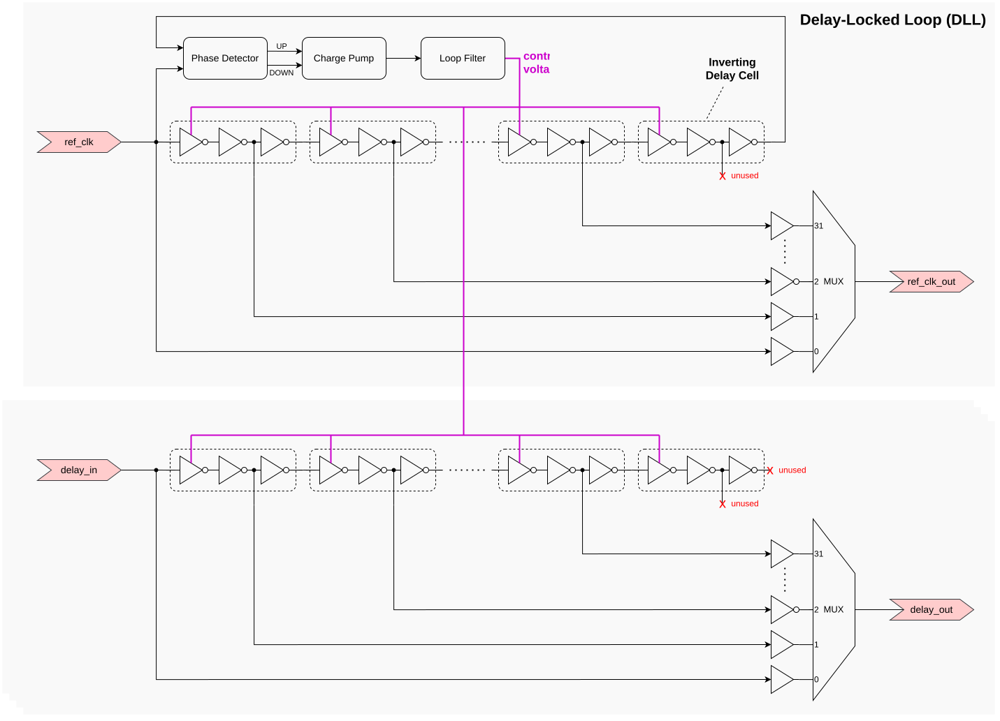

<!---

This file is used to generate your project datasheet. Please fill in the information below and delete any unused
sections.

You can also include images in this folder and reference them in the markdown. Each image must be less than
512 kb in size, and the combined size of all images must be less than 1 MB.
-->

## Overview

This project is a 4 Channel - 32 Tap Programmable Delay with Delay Locked Loop Calibration. It delays a digital signal by between 0 and up to 31 taps, with each tap providing 0.625 ns of delay, resulting in a maximum total delay of 19.375 ns when using a 50 MHz external reference clock. Intended applications include data alignment/ adding additional delay to meet setup/hold constraints, which may be especially valuable given the high latency of Tiny Tapeout’s mux infrastructure.

## How to use

Provide a 50 MHz reference clock to the `ref_clk` pin (not `clk`), as well as any signal you want to delay on the channel input pins. You should observe a delayed version on the corresponding channel output pin. The total delay is a sum of delay caused by the delay line itself (0 to 19.375ns), the delay line multiplexer (~0.6ns), and Tiny Tapeout’s mux infrastructure (10+ ns).


| Top Level Pin | Specific Name  | Direction | Width  | Description                                   |
| :------------ | :------------- | :-------- | :----- | :-------------------------------------------- |
| clk           | -              | Input     | 1 bit  | Non-free running clock for registers         |
| rst_n         | -              | Input     | 1 bit  | Active-low reset for registers                |
| ui[3:0]       | delay_in[3:0]  | Input     | 4 bits | Signal to be delayed (4 independent channels) |
| ui[4]         | ref_clk        | Input     | 1 bit  | 50 MHz reference clock for DLL                |
| ui[5]         | dll_rst_n      | Input     | 1 bit  | Active-low reset for DLL                      |
| ui[7:6]       | -              | Input     | 2 bits | Unused                                        |
| uio[2:0]      | reg_addr[2:0]  | Input     | 3 bits | Register address value to write               |
| uio[7:3]      | reg_val[4:0]   | Input     | 5 bits | Register data value to write                  |
| uo[3:0]       | delay_out[3:0] | Output    | 4 bits | Delayed signal (4 independent channels)      |
| uo[4]         | ref_clk_out    | Output    | 1 bit  | Delayed reference clock                      |
| uo[7:5]       | -              | Output    | 3 bit  | Unused                                        |

The initialization procedure for the DLL and the register control can be done independently or simultaneously.

### Initialization procedure for DLL:

1. Ensure `dll_rst_n` is low for at least 1ms to be safe.
2. Raise `dll_rst_n` high for at least 5ms to be safe.
3. Keep `dll_rst_n` high. The DLL should be locked at this point.

### Initialization procedure for registers:

1. Ensure `rst_n` and `clk` are low for some time.
2. Raise `clk` high.
3. Make `clk` low.
4. Raise and keep `rst_n` high.

Once initialized, to write a delay value to a register, set the 3 bit register address and the 5 bit delay tap amount to the correct value. Wait for a little, then raise `clk` high for some time, then make `clk` low.


| Register Address |       Register Name       |
| :--------------: | :-----------------------: |
|        0        |    Channel 0 Tap Value    |
|        1        |    Channel 1 Tap Value    |
|        2        |    Channel 2 Tap Value    |
|        3        |    Channel 3 Tap Value    |
|        4        | Reference Clock Tap Value |

Note: Reference Clock Tap Value does not affect the DLL or the delay of the other channels.

## Overview of architecture

This is mixed-signal design, with the `hx_delay_bank` analog macro block being layout by hand, and the digital register control logic written in verilog. Place-and-route for the digital block, as well as integration of the hand-crafted analog macro block is done automatically.



The `hx_delay_bank` analog macro block consists of five identical delay lines, one of which is used within a Delay-Locked Loop (DLL). The DLL determines the control voltage required, so as to set the total delay of that delay line to exactly one clock period. This same control voltage is used to set the delay of the remaining four delay lines to one clock period as well (assuming the delay lines are well matched). The desired delay is selected by tapping the appropriate point along the delay line using a multiplexer.

Here is the hierarchy for the analog macro block:

```
hx_delay_bank
  hx_delay_line_with_mux (5x total) ✓
    hx_delay_line
      hx_delay_cell (32x total)
      hx_delay_cell_left_endcap
      hx_delay_cell_right_endcap
    hx_mux
      hx_mux_predecoder
      hx_mux_4to1_leaf (8x total)
      hx_mux_4to1_intermediate (2x total)
      hx_mux_2to1_root ✓
  hx_delay_line_with_mux_dll
    hx_dll_controller
      hx_charge_pump_current_generator
      hx_charge_pump_switch
      hx_loop_capacitor
      hx_phase_detector
    hx_delay_line_with_mux (reused)
```

For more details, it is worthwhile to look into the Xschem schematics provided.

## Delay Line Design

Each delay line consists of 32 delay cells. Each delay cell is built around a current-starved inverter, plus 2 additional inverters. The delay can be tuned by controlling the bias voltages (to be explained later). The additional inverters isolate the delay line from external loading effects, such as those from the mux. By making each delay cell inverting, any mismatches between rise and fall propagation delay is effectively canceled from one cell to the next, preventing them from accumulating over the entire delay line, as described in [1].

The delayed signal can then be tapped along the delay line. However, because each delay cell is inverting, to get the correct non-inverted signal, there would be a one-inverter delay difference between odd and even delay cells. This difference can be avoided by tapping every 2 cells, but the small delay difference did not justify the added area/ loss of tap resolution.

The minimum delay of the entire delay line (when `DELAY_VBIASN` is set to VDD), measuring from start to the end, is approximately 10ns when considering parasitics, and at a typical process corner. It was observed that parasitics and process corners play a large impact here. So this sets an upper bound on the max frequency of the reference clock that can be supplied to the DLL, which was why 50MHz was chosen.

## Mux Design

To make the delay digitally programmable, a 32 to 1 mux constructed out of a tree of 4:1 and 2:1 transmission gate muxes. 2 to 4 predecoders [2] were necessary to convert select signals into one hot encoded signal for the 4:1 muxes.

## Delay Locked Loop (DLL) Design

The DLL consists of a phase detector, charge pump (and current bias generator), loop filter (just a capacitor in parallel at the output of the charge pump), and voltage controlled delay line.

The DLL tries to make the phase error between the `REF_CLK` and its delayed version be 0. However, when using the conventional D flip flop phase detector, the DLL may lock to a multiple of T<sub>REF_CLK</sub> like 2<sub>TREF_CLK</sub> , 3<sub>TREF_CLK</sub> etc in a phenomenon called harmonic locking. Stuck/false locking is the special case when the DLL locks to the minimum delay possible which may occur when T<sub>initial</sub> is less than T<sub>REF_CLK</sub>.

* The problem of harmonic locking can be avoided by initializing the loop filter capacitor at VDD, and thus achieving minimum delay initially.
* The problem of stuck/false locking can be worked around by designing the phase detector to ignore the first rising edge of the reference clock.

Both of these solutions require the system to start from a known state, and hence `DLL_RESET` is required. Note however, that if the DLL somehow locks to an unwanted state, it cannot recover on its own, more sophisticated designs may be able to handle this. A wide range of design ideas can be found in the literature, see [3, 4, 5, 6, 7, 8, 9].

The current design does not implement a lock detection feature, that is, a feature to detect if the DLL has locked correctly to one clock period of the reference clock. Once again, a wide range of design ideas can be found in the literature, for example [10].

## DLL: Phase detector design

The phase detector is a variation of the conventional D flip flop design. To work around the stuck/false locking problem mentioned earlier, an extra flip flop is needed, thus bringing the total number of flip flops to 3. Standard cell library D flip flops (with reset) were used as they are well tested.

## DLL: Charge Pump 10uA Current Generator Design

The design is a simple ‘Beta Multiplier’ circuit with a resistor which generates a 10uA current. It attains 10% variation in current from 1.0 to 1.2V for supply voltage VDD (although note the supply voltage is fixed at 1.2V, so no big deal). A somewhat large variation across temperature is expected for this type of design (it is Proportional to Absolute Temperature (PTAT)), I got a 40% variation in current from 25 degree C to 125 degree C, which is bad, but the design should still be workable as DLL are inherently stable, just that the lock time/bandwidth may vary.

## Register Control Logic Design

The register control logic is rudimentary but functional; on the rising edge of system `clk`, the corresponding register is written with the values present on the data pins at that point in time. In the future, the delay line may be incorporated into a larger design which may include more robust interfaces like a standard SPI bus.

## Additional notes

I did not add any antenna diodes into the macro itself, but some wires are actually a little long, so it may not be a bad idea to add them.

A real-world application of a delay line can be found in the SPI peripheral of the S32G Vehicle Network Processor [11].

## Documentation

Diagrams were drawn using `draw.io`, with some icons from the [Draw-io-ECE](https://github.com/NicklasVraa/Draw-io-ECE) project.

## References

1. Heck, G., Heck, L. S., Singhvi, A., Moreira, M. T., Beerel, P. A., & Calazans, N. L. (2015). Analysis and Optimization of Programmable Delay Elements for 2-Phase Bundled-Data Circuits. 2015 28th International Conference on VLSI Design, 321–326. https://doi.org/10.1109/vlsid.2015.60
2. Implementation and verification of decoder/de-multiplexer and encoder using logic gates. (n.d.). Virtual Labs. https://de-iitr.vlabs.ac.in/exp/decoder-demultiplexer-encoder/theory.html
3. Bae, Woorham. (2016). Delay-Locked Loops: False Locking Issues. https://doi.org/10.13140/RG.2.1.2798.1208
4. Gs, Javed & Khatri, Vishal & Raja, Immanuel & Lenka, Manas & Banerjee, Gaurab. (2014). Differential multi-phase DLL for reconfigurable radio frequency synthesizer. IEEE CONECCT 2014 - 2014 IEEE International Conference on Electronics, Computing and Communication Technologies. 1-5. 10.1109/CONECCT.2014.6740334. https://doi.org/10.1109/CONECCT.2014.6740334
5. Du, Q., Zhuang, J., & Kwasniewski, T. (2006). A Low-Phase noise, Anti-Harmonic programmable DLL frequency multiplier with period error compensation for spur reduction. IEEE Transactions on Circuits and Systems II Analog and Digital Signal Processing, 53(11), 1205–1209. https://doi.org/10.1109/TCSII.2006.883103
6. Chang, H., Lin, J., Yang, C., & Liu, S. (2002). A wide-range delay-locked loop with a fixed latency of one clock cycle. IEEE Journal of Solid-State Circuits, 37(8), 1021–1027. https://doi.org/10.1109/jssc.2002.800922
7. Song, E., Lee, S., Lee, J., Park, J., & Chae, S. (2004). A reset-free anti-harmonic delay-locked loop using a cycle period detector. IEEE Journal of Solid-State Circuits, 39(11), 2055–2061. https://doi.org/10.1109/jssc.2004.835840
8. Design of Delay Locked Loop with Frequency Division Technique. (2016). Proceedings of 2016 the 6th International Workshop on Computer Science and Engineering. https://doi.org/10.18178/wcse.2016.06.095
9. Cho, S., & Cho, Y. (2022). A 1.2 V 0.4 mW 20~200 MHz DLL Based on Phase Detector Measuring the Delay of VCDL. Electronics, 11(15), 2434. https://doi.org/10.3390/electronics11152434
10. Sherafath, M. a. M., & Aziz, Z. a. A. (n.d.). A Novel High Accuracy Digital Lock Detector with False Lock Detection. Scientific & Academic Publishing. http://article.sapub.org/10.5923.j.ac.20130303.06.html
11. SPI peripheral S32G QuadSPI Deep Dive. (n.d.). NXP Semiconductors. https://www.nxp.com/docs/en/application-note/AN13563.pdf

## Additional References
Design of a PLL: https://github.com/LegumeEmittingDiode/tt08-tiny-pll/blob/main/docs/info.md

Excellent diagram of false and harmonic locking: https://www.semanticscholar.org/paper/A-2.2-mW-20%E2%80%93135-MHz-False-Lock-Free-DLL-for-Display-Moon-Kong/659ca674d31b180402f3ab807b3fcb037b88fa1e/figure/0

Diagram of harmonic locking: https://www.researchgate.net/figure/Explanation-of-harmonic-lock-and-proposed-shot-pulse-reset-operation_fig10_258383043

Diagram of DLL and delay line: https://www.researchgate.net/figure/Diagram-and-locations-of-IDELAY-and-IDELAYCTRL-modules_fig2_325562388

Good and clear educational series of videos about Delay-Locked Loop by SSCD IIT Kanpur:
- Lecture 3: Delay-locked loop, tunable delay line https://www.youtube.com/watch?v=GZT11SQSxH8
- Lecture 7: Locking in a DLL https://www.youtube.com/watch?v=7_8qSAc9hiE
- Lecture 8: Locking nonidealities in a DLL https://www.youtube.com/watch?v=vZTfCbJRciI
- Lecture 10: Charge pumps - II https://www.youtube.com/watch?v=xUf4xchqS0o

https://blog.eetop.cn/forum.php?mod=viewthread&tid=149458&page=1&mobile=no