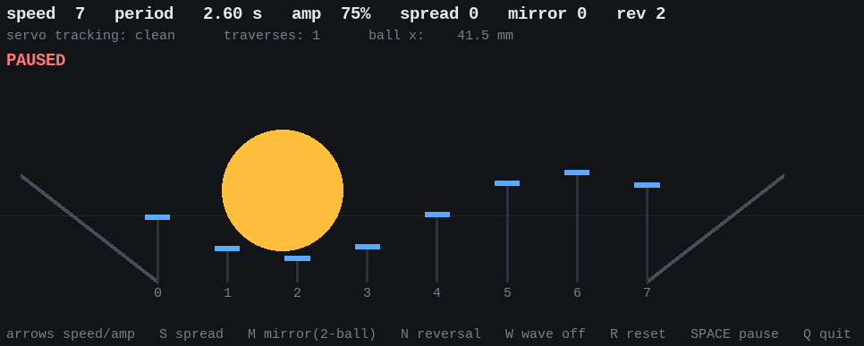

<!---

This file is used to generate your project datasheet. Please fill in the information below and delete any unused
sections.

You can also include images in this folder and reference them in the markdown. Each image must be less than
512 kb in size, and the combined size of all images must be less than 1 MB.
-->

## How it works

The Kinematic Wave Engine is a dedicated 8-channel servo controller.
It autonomously drives an 8-rod kinetic sculpture, generating a continuous
travelling sinusoidal wave that (is supposed) to move a ping-pong ball back and forth along its track.

It is an interactive art piece demonstrating parallel hardware timing, real-time
procedural animation, and custom silicon design.

This project was essentially a learning experience for me. It may not be the most useful project, it may not be optimized (or even working at the end), but it's mine and has been a great learning vehicle :)

## How to test

### Simulation
You can find a Python-based 2D physics simulation in the sim/ folder to better understand about the final goal.
The simulation was used to fine-tune default and hardcoded parameters.

### FPGA
To increase the confidence even more, the design was tested on an FPGA (CMOD A7 devkit - Artix 7).
All looked good, fingers crossed.

### For Real
The final kinematic sculpture does not exist yet. I will have the full manufacturing time to develop it !

It basically will be a simple mechanical assembly of 8 rods controlled by 8 servo motors. (see the simulation view)
The servos will need an external power source. Each servo motor signal will connect to the 8x outputs. The IC is doing the precise timing control of each servo signal and generates the traveling wave.

Input signals are used to provide some minimal control:
- ui_in[4:1] - speed selection: 16 wave periods, 20.1 s .. 0.26 s
- ui_in[6:5] - amplitude selection: 25 / 50 / 75 / 100 %
- ui_in[7] - spread selection: 0 = full wavelength, 1 = half
- uio_in[4] - mirror: 1 = two-ball mirrored mode
- uio_in[6:5] - reverse selection: reverse after 2 / 3 / 4 / 6 cycles

## External hardware

8x servo (like SG90) + kinematic rod sculpture
